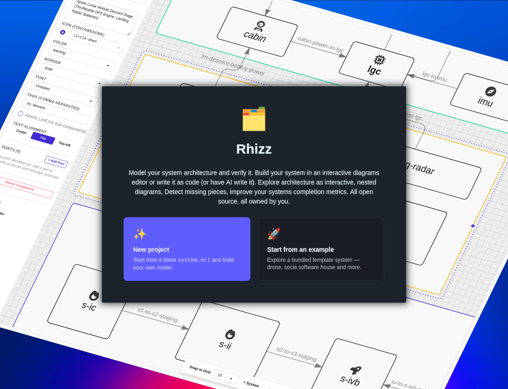

# Rhizz — Rhizomatic Systems Engineering

Rhizz strives to be an actually useful architecture tool for software
architects. Express high-level system concepts as code and validate them with a
compiler accepting different levels of precision, from a business-level
description, all the way to a byte-by-byte interface definition.

In other words - a code-first [MBSE](https://baczek.me/mbse) tool.



## Core Ideas

**Code-first modeling** — components, interfaces, and messages live in plain HCL
(same syntax as Terraform). All `.hcl` files in a directory are merged into one
model, so you can split the description across as many files as you like.

**Completion score** — `rhizz score` measures how fully a system is decomposed.
Sketch a high-level architecture first, fill in details over time, and track
progress numerically:

```
Components:  8/12 complete  (66.7%)
Interfaces:  3/7  complete  (42.9%)
Messages:    5/10 complete  (50.0%)
Overall:     16/29           55.2%
```

**Definable views** — `view` blocks render filtered Graphviz diagrams from the
same model. Show only power paths, zoom into one subsystem, or hide low-level
wiring for a stakeholder review — all without touching the model itself:

```hcl
view "power-paths" {
  system = "quadcopter"
  filter { include_tags = ["power"]; show_messages = false }
}
```

## CLI

```
rhizz check [path]   # parse and validate
rhizz score [path]   # print completion report
rhizz views [path]   # generate .dot diagrams
rhizz build [path]   # all of the above (default)
```

See `SPEC.md`, `SPEC/`, and `examples/` for the full specification and worked
examples.

## Server

`rhizz-server` is a standalone HTTP server (axum) that serves the compiled web
editor and persists the frontend's virtual filesystem:

```
rhizz-server                  # serves UI on 127.0.0.1:3000
```

The frontend persists to the server when built with
`VITE_RHIZZ_SERVER_URL` set (otherwise it runs fully in the browser via
localStorage):

```
VITE_RHIZZ_SERVER_URL=http://localhost:3000 just build
```

Environment variables:

| Variable             | Default          | Meaning                                     |
| -------------------- | ---------------- | ------------------------------------------- |
| `RHIZZ_ADDR`         | `127.0.0.1:3000` | Listen address                              |
| `RHIZZ_DATA_DIR`     | `./rhizz-data`   | Where per-project VFS dumps are stored      |
| `RUST_LOG`           | `info`           | tracing log level (`debug`, `warn`, ...)    |

No authentication is implemented — the server assumes a public, trusted
environment.

> **Concurrency:** the VFS persistence API is a read-modify-write of the
> whole blob with no locking or revision check. Two clients editing the
> same project concurrently will silently overwrite each other (last write
> wins). This is an accepted limitation for the current MVP stage; a
> revision/ETag check is planned before multi-user use.

## Development commands

See the [Justfile](Justfile).

## Links

- [WASM Bindgen Guide](https://wasm-bindgen.github.io/wasm-bindgen/introduction.html) -
  search engines are not finding it for some reason...
