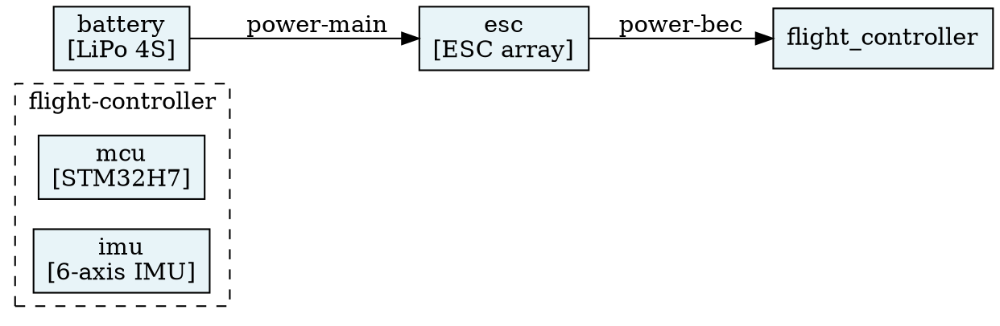

# `rhizz` Specification v0.4

Rhizz is a code-first system architecture modeling tool. It combines:

- Architecture modeling
- Model-based Systems Engineering (MBSE)
- Code-first approach
- Gradual compilation (or rather validation) of your model

The goal of Rhizz is to make Software Architecture something more than drawing
diagrams and writing lengthy design documents. It provides a formalized modeling
language for defining system architectures at various levels of abstraction.

## 1. Project Structure

A project consists of a single system model file (`system.hcl` or `main.hcl`) containing the system architecture model (including optional `project` metadata), and optional view definition files (`views.hcl` or as many view files as the user creates):

```
project/
├── system.hcl           # single system architecture model (optional project {} + systems/components)
└── views.hcl            # view definitions and visual layout metadata (or multiple view files)
```

All architecture entities (`project`, `system`, `component`, `port`, `connection`, `message`, `field`) are maintained in the system model file. This single-file model structure enables bidirectional translation: visual editing in the UI deterministically serializes the complete model back to HCL without cross-file resolution ambiguity.

View configurations, filters, and visual layout positions remain separated in `views.hcl` (and any additional view definition files).

---

## 2. HCL Schema

> **Impl:** see [SPEC/models.md](SPEC/models.md) — raw deserialization structs,
> HCL parsing strategy, and resolved model types.

### 2.1 `project` Block (Optional)

```hcl
project {
  name    = "military-drone"
  version = "0.1.0"
  authors = ["Alice", "Bob"]
}
```

| Attribute | Type         | Required | Default        | Description                 |
| --------- | ------------ | -------- | -------------- | --------------------------- |
| `name`    | string       | no       | directory name | Human-readable project name |
| `version` | string       | no       | `"0.0.0"`      | Semantic version            |
| `authors` | list(string) | no       | `[]`           | List of authors             |

---

### 2.2 `system` Block

Top-level block. One or more per project. One of possible realizations of your
project, be it a final product, one of your product variants, a prototype or a
testing setup.

```hcl
system "consumer-drone" {
  description = "Consumer quadcopter drone"
  tags        = ["product", "drone", "v1"]
  level       = 0

  component "flight-controller" { /* ... */ }
  component "propulsion"        { /* ... */ }

  connection "fc-to-prop" { /* ... */ }
}
```

| Attribute     | Type         | Required | Default | Description                |
| ------------- | ------------ | -------- | ------- | -------------------------- |
| _label_       | string       | **yes**  | —       | Unique system identifier   |
| `description` | string       | no       | `""`    | Human-readable description |
| `tags`        | list(string) | no       | `[]`    | Filtering tags             |
| `level`       | integer      | no       | `0`     | Abstraction level          |

**Children:** `component`, `connection`

---

### 2.3 `component` Block

Represents a physical or logical building block. Defined inside a `system`, inside
another `component`, or at the top level. Components declare their external
interface via `port` blocks; ports are allowed on both leaf and non-leaf
components.

```hcl
component "flight-controller" {
  description = "Central flight management unit"
  tags        = ["electronics", "compute"]
  level       = 1
  leaf        = false

  port "dshot" {
    protocol = "dshot600"
    role     = "provider"
    /* ... */
  }

  component "mcu" { /* ... */ }
  component "imu" { /* ... */ }

  connection "spi-bus" { /* ... */ }
}
```

#### Top-level components and `source`

A `component` block may appear at the **top level** of any `.hcl` file
(alongside `system`, `view`, and `project`). Top-level components are not part
of any system by themselves — they serve as reusable definitions that can be
pulled into a system or parent component via the `source` attribute.

```hcl
# components/flight-controller.hcl — a normal rhizz file
component "flight-controller" {
  description = "Main flight computer"
  tags        = ["electronics", "compute"]
  leaf        = false

  port "motor-out" { protocol = "dshot600"; role = "provider" }
  component "mcu"  { /* ... */ }
  connection "spi-bus" { /* ... */ }
}
```

Inside a system (or parent component), reference it by label:

```hcl
system "quadcopter" {
  # Instantiate the top-level component by label.
  # The label at the usage site ("fc") becomes the component's name in this system.
  component "fc" {
    source = "flight-controller"
  }

  # Or keep the same name:
  component "flight-controller" {
    source = "flight-controller"
  }
}
```

**Rules:**

- `source` is a **label reference** to a top-level `component`, not a file path.
  Resolution happens during the resolution pass (after merge), using the same
  label lookup mechanism as `view.system`.
- When `source` is present, **no other attributes or child blocks** may appear
  on the component (error E012). The label at the usage site is the only
  locally-defined property.
- Nested `source` is supported: a top-level component may itself contain
  children with `source` references to other top-level components.
- Circular `source` chains are detected and produce error E013.
- `source` references an undefined top-level component → error E014.
- **Top-level components may not contain `connection` blocks that reference
  siblings outside their own tree.** Connections inside a top-level component
  wire its own children — they cannot reference components from the system that
  sources them. (Connections at the system level wire sourced components
  together.)
- Top-level components that are not referenced by any `source` in any system
  produce warning W012 (orphan top-level component).
- Duplicate top-level component labels across files are an error (E001 — same
  scope, same block type).
- Top-level components are **not** included in scoring or view rendering unless
  they are sourced into a system.

#### Attributes

| Attribute     | Type         | Required | Default          | Description                                                                                                                         |
| ------------- | ------------ | -------- | ---------------- | ----------------------------------------------------------------------------------------------------------------------------------- |
| _label_       | string       | **yes**  | —                | Unique identifier within parent scope (or unique top-level label)                                                                   |
| `source`      | string       | no       | —                | Label of a top-level `component` to use as this component's body. Mutually exclusive with all other attributes and children (E012). |
| `description` | string       | no       | `""`             | Human-readable description                                                                                                          |
| `tags`        | list(string) | no       | `[]`             | Filtering tags                                                                                                                      |
| `level`       | integer      | no       | parent level + 1 | Abstraction level                                                                                                                   |
| `leaf`        | bool         | no       | `false`          | If `true`, component is atomic — may not contain child `component` or `connection` blocks                                           |

**Children:** `port` (any), `component` (if not leaf), `connection` (if not
leaf, between child components)

---

### 2.4 `port` Block

Defined inside a `component`. Declares a typed connection point exposed by that
component. Ports carry `message` blocks that describe the protocol schema,
keeping protocol definitions co-located with the component that owns them.

```hcl
port "spi" {
  description = "SPI master interface"
  protocol    = "spi"
  role        = "provider"
  tags        = ["electronics", "data"]

  message "transaction" {
    description = "SPI transfer frame"
    field "cs"   { type = "uint8";  description = "Chip select line" }
    field "data" { type = "bytes";  description = "Payload"          }
  }
}
```

| Attribute     | Type         | Required | Default  | Description                                                              |
| ------------- | ------------ | -------- | -------- | ------------------------------------------------------------------------ |
| _label_       | string       | **yes**  | —        | Unique identifier within the parent component                            |
| `protocol`    | string       | no       | `""`     | Free-form protocol name; matched against the connected port's `protocol` |
| `role`        | string       | no       | `"peer"` | `"provider"`, `"consumer"`, or `"peer"`                                  |
| `description` | string       | no       | `""`     | Human-readable description                                               |
| `tags`        | list(string) | no       | `[]`     | Filtering tags                                                           |

**Children:** `message`

---

### 2.5 `connection` Block

Defined inside a `system` or `component`. Wires two **sibling** components
together. The `from` and `to` fields accept either a bare component label or a
`component:port` reference. When a port is named, protocol and role
compatibility is validated at resolution time. The connection carries no
messages and no direction — both are derived from the connected ports.

```hcl
connection "spi-bus" {
  description  = "SPI link between MCU and IMU"
  tags         = ["electronics", "data"]
  level        = 2
  from         = "mcu:spi"   # typed — references port "spi" on component "mcu"
  to           = "imu"       # untyped — W007 will fire
  encapsulates = []
}
```

| Attribute      | Type         | Required | Default          | Description                                                    |
| -------------- | ------------ | -------- | ---------------- | -------------------------------------------------------------- |
| _label_        | string       | **yes**  | —                | Unique identifier within parent scope                          |
| `from`         | string       | **yes**  | —                | `"comp"` or `"comp:port"` — source component and optional port |
| `to`           | string       | **yes**  | —                | `"comp"` or `"comp:port"` — target component and optional port |
| `description`  | string       | no       | `""`             | Human-readable description                                     |
| `tags`         | list(string) | no       | `[]`             | Filtering tags                                                 |
| `level`        | integer      | no       | parent level + 1 | Abstraction level                                              |
| `encapsulates` | list(string) | no       | `[]`             | Labels of sibling connections this one runs on top of          |

**No `direction` attribute** — direction is inferred from the `role` values of
the connected ports (see §6).

**No child blocks** — messages belong to `port` blocks, not connections.

---

### 2.6 `message` Block

Defined inside a `port`. Represents a discrete unit of information exchanged
over that port's protocol. Keeping messages on the port ensures the protocol
schema travels with the component.

```hcl
message "position-report" {
  description = "Periodic GPS position update"
  tags        = ["telemetry", "gps"]
  level       = 1

  field "latitude"  { type = "float64"; unit = "deg"; description = "WGS84 latitude"  }
  field "longitude" { type = "float64"; unit = "deg"; description = "WGS84 longitude" }
  field "altitude"  { type = "float64"; unit = "m";   description = "Altitude MSL"    }
  field "timestamp" { type = "uint64";  unit = "ms";  description = "Unix timestamp"  }
}
```

| Attribute     | Type         | Required | Default      | Description                              |
| ------------- | ------------ | -------- | ------------ | ---------------------------------------- |
| _label_       | string       | **yes**  | —            | Unique identifier within the parent port |
| `description` | string       | no       | `""`         | Human-readable description               |
| `tags`        | list(string) | no       | `[]`         | Filtering tags                           |
| `level`       | integer      | no       | parent level | Abstraction level                        |

**Children:** `field`

---

### 2.7 `field` Block

Defined inside a `message`. Describes a single data element.

```hcl
field "altitude" {
  type        = "float64"
  unit        = "m"
  description = "Altitude above mean sea level"
  required    = true
}
```

| Attribute     | Type   | Required | Default | Description                                                                   |
| ------------- | ------ | -------- | ------- | ----------------------------------------------------------------------------- |
| _label_       | string | **yes**  | —       | Unique field name within parent message                                       |
| `type`        | string | **yes**  | —       | Free-form type string (e.g. `"uint8"`, `"string"`, `"bool"`, `"enum(A,B,C)"`) |
| `description` | string | no       | `""`    | Human-readable description                                                    |
| `unit`        | string | no       | `""`    | Physical unit (e.g. `"m"`, `"Hz"`, `"V"`)                                     |
| `required`    | bool   | no       | `true`  | Whether the field is mandatory in the message                                 |

---

### 2.8 `view` Block

Top-level block (not nested inside a system). Defines a filtered perspective
rendered as a Graphviz diagram.

```hcl
view "power-distribution" {
  description = "Power delivery paths across the drone"
  tags        = ["power", "review"]
  level       = 0

  system = "consumer-drone"

  filter {
    include_tags   = ["power"]
    exclude_tags   = ["debug"]
    max_level      = 2
    components     = []          # empty = all (whitelist, optional)
    show_messages  = false
  }

  output {
    filename = "power-distribution.dot"
    rankdir  = "LR"             # Graphviz rank direction: TB, LR, BT, RL
  }
}
```

**`filter` sub-block:**

| Attribute       | Type         | Required | Default          | Description                                                               |
| --------------- | ------------ | -------- | ---------------- | ------------------------------------------------------------------------- |
| `include_tags`  | list(string) | no       | `[]` (match all) | Only include entities having ≥1 of these tags                             |
| `exclude_tags`  | list(string) | no       | `[]`             | Exclude entities having any of these tags                                 |
| `max_level`     | integer      | no       | `∞`              | Maximum abstraction level to display                                      |
| `components`    | list(string) | no       | `[]` (all)       | Whitelist of component labels to include                                  |
| `show_messages` | bool         | no       | `true`           | Whether to list messages (from connected ports) as connection edge labels |

**`output` sub-block:**

| Attribute  | Type   | Required | Default              | Description               |
| ---------- | ------ | -------- | -------------------- | ------------------------- |
| `filename` | string | no       | `"{view-label}.dot"` | Output file path          |
| `rankdir`  | string | no       | `"TB"`               | Graphviz layout direction |

---

## 3. Reference Resolution

> **Impl:** see [Scope lookup helper](SPEC/models.md#scope-lookup-helper) and
> [Resolution pass](SPEC/models.md#resolution-pass) in models.md.

All references are **name-based within the same parent scope**:

| Context                                           | Reference resolves to                                      |
| ------------------------------------------------- | ---------------------------------------------------------- |
| `connection.from` / `connection.to` (bare label)  | Sibling `component` labels in the same parent scope        |
| `connection.from` / `connection.to` (`comp:port`) | Sibling `component` label + named `port` on that component |
| `encapsulates`                                    | Sibling `connection` labels in the same parent scope       |
| `component.source`                                | Top-level `component` label                                |
| `view.system`                                     | Top-level `system` label                                   |

**No cross-scope references in v1.** If a connection spans abstraction levels,
model it at the appropriate parent scope.

---

## 4. Validation Rules

> **Impl:** validation operates on the
> [resolved `Model`](SPEC/models.md#core-resolved-structs). Errors/warnings are
> collected as `Diagnostic` values during the
> [resolution pass](SPEC/models.md#resolution-pass).

Each diagnostic code is documented in its own file under
[`SPEC/diagnostics/`](SPEC/diagnostics/) (e.g. `E001.md`, `W003.md`). Error
codes (`Exxx`) halt compilation; warning codes (`Wxxx`) are non-blocking.

---

## 5. Completion Scoring

> **Impl:** scoring iterates over `Model.components`, `Model.ports`,
> `Model.connections`, and `Model.messages`, see
> [resolved models](SPEC/models.md#core-resolved-structs). The `leaf`,
> `children`, `ports`, `messages`, and `fields` fields on those structs provide
> all inputs needed.

The completion score quantifies how fully the system has been decomposed and
specified to leaf-level entities. Each entity is scored individually, then
aggregated.

### Per-Entity Completeness

| Entity                   | Complete (1.0)                                          | Partial (0.5)                                 | Incomplete (0.0)    |
| ------------------------ | ------------------------------------------------------- | --------------------------------------------- | ------------------- |
| **Component** (leaf)     | Has description AND all defined ports complete          | Has description but ≥1 port incomplete        | No description      |
| **Component** (non-leaf) | ≥1 child component, all children complete               | ≥1 child component, not all children complete | No child components |
| **Port**                 | ≥1 message, all messages complete                       | ≥1 message, not all messages complete         | No messages         |
| **Connection**           | Both sides typed (`comp:port`) with matching `protocol` | One side typed                                | Both sides untyped  |
| **Message**              | ≥1 field                                                | —                                             | No fields           |

A leaf component with a description and no ports scores Complete (1.0) — ports
are optional detail.

### Aggregate Score

$$\text{Score} = \frac{\sum_{i=1}^{N} s_i}{N} \times 100\%$$

Where $s_i$ is the per-entity completeness (0.0, 0.5, or 1.0) and $N$ is the
total number of components, ports, connections, and messages. Fields and the
system block itself are excluded from scoring.

### Output Format

```
Completion Report — consumer-drone
───────────────────────────────────
Components:   8/12 complete  (66.7%)
Ports:        4/8  complete  (50.0%)
Connections:  3/7  complete  (42.9%)
Messages:     5/10 complete  (50.0%)
───────────────────────────────────
Overall:      20/37           54.1%
```

---

## 6. View Generation (Graphviz)

> **Impl:** the `View`, `ViewFilter`, and `ViewOutput` structs are defined in
> [view models](SPEC/models.md#view-models). The renderer reads from the
> resolved `Model` and applies filter predicates against tags, levels, and
> component whitelist. DOT string generation is provided by the shared
> `rhizz-dot` crate (see Section 12) so that any frontend can produce `.dot`
> output without re-implementing the logic.

Connection direction is inferred from the `role` values of the connected ports:

| `from` role         | `to` role                | Inferred direction             | DOT representation        |
| ------------------- | ------------------------ | ------------------------------ | ------------------------- |
| `provider`          | `consumer`               | unidirectional (`from` → `to`) | directed arrow            |
| `consumer`          | `provider`               | unidirectional (`to` → `from`) | directed arrow (reversed) |
| `peer`              | `peer`                   | bidirectional                  | undirected line           |
| either side untyped | —                        | unknown                        | dashed line               |
| `provider`          | `provider`               | ambiguous → W009               | dashed line               |
| `consumer`          | `consumer`               | ambiguous → W009               | dashed line               |
| `peer`              | `provider` or `consumer` | ambiguous → W009               | dashed line               |

The view renderer applies the filter, then produces a DOT file:

| Model Entity         | Graphviz Representation                                                 |
| -------------------- | ----------------------------------------------------------------------- |
| Component (leaf)     | Box node, solid border                                                  |
| Component (non-leaf) | `subgraph cluster_*` containing children                                |
| Connection           | Edge with direction inferred from port roles (see table above)          |
| Message              | Items in edge label (from connected port(s), if `show_messages = true`) |
| Encapsulation        | Dashed edge between connections, or annotation on label                 |

Example generated DOT fragment:



---

## 7. CLI Interface

> **Impl:** see [SPEC/cli.md](SPEC/cli.md) — `clap` struct layout, JSON output
> schema, pipeline stages, and error formatting.

The CLI is implemented in the `rhizz-cli` crate, which is a thin frontend over
`rhizz-core`. It is responsible for file discovery, output formatting, exit
codes, and writing generated `.dot` files to disk. All model compilation,
validation, scoring, and view rendering logic lives in `rhizz-core` and
`rhizz-dot` — `rhizz-cli` contains no model logic of its own.

```
rhizz <command> [options] [path]
```

| Command              | Description                                                            |
| -------------------- | ---------------------------------------------------------------------- |
| `rhizz check <path>` | Parse, validate, and report errors/warnings. Exit code 0 if no errors. |
| `rhizz score <path>` | Run `check`, then print the completion report.                         |
| `rhizz views <path>` | Run `check`, then generate all defined views as `.dot` files.          |
| `rhizz build <path>` | Run all of the above in sequence (default command).                    |

### Options

| Flag                 | Description                                              |
| -------------------- | -------------------------------------------------------- |
| `--output-dir`, `-o` | Directory for generated `.dot` files (default: `./out/`) |
| `--strict`           | Treat warnings as errors                                 |
| `--json`             | Output report in JSON format (for CI/CD integration)     |
| `--view <name>`      | Only generate a specific view (with `views`/`build`)     |
| `--no-color`         | Disable colored terminal output                          |

### Example Session

```bash
$ rhizz build ./drone-project/

  Parsing 2 files...
  ✓ Parsed: system.hcl, views.hcl

  Validation:
  ✗ E002  system.hcl:14  connection "uart-link" references undefined component "gps-module"
  ⚠ W001  system.hcl:31  component "power-regulator" has no child components (leaf=false)
  ⚠ W004  system.hcl:82  component "motor" is missing a description

  1 error, 2 warnings — aborting (fix errors to continue)
```

```bash
$ rhizz build ./drone-project/   # after fix

  Parsing 2 files... ✓

  Validation:
  ⚠ W001  system.hcl:31  component "power-regulator" has no child components (leaf=false)
  ⚠ W004  system.hcl:82  component "motor" is missing a description
  0 errors, 2 warnings

  Completion Report — mini-drone
  ───────────────────────────────────
  Components:   8/12 complete  (66.7%)
  Ports:        4/8  complete  (50.0%)
  Connections:  3/7  complete  (42.9%)
  Messages:     5/10 complete  (50.0%)
  ───────────────────────────────────
  Overall:      20/37           54.1%

  Views:
  ✓ out/full-system.dot
  ✓ out/power-only.dot
  ✓ out/fc-internals.dot

  Done.
```

---

## 8. Full Example

A minimal but complete drone project defined in `system.hcl` and `views.hcl`:

### `system.hcl`

```hcl
project {
  name    = "mini-drone"
  version = "0.1.0"
}

system "mini-drone" {
  description = "Minimal quadcopter drone"
  tags        = ["product", "drone"]
  level       = 0

  # ── Components ────────────────────────────

  component "flight-controller" {
    description = "Central flight management unit"
    tags        = ["electronics", "compute"]
    leaf        = false

    port "dshot" {
      description = "DShot600 motor control output"
      protocol    = "dshot600"
      role        = "provider"
      tags        = ["electronics", "motor", "data"]

      message "throttle-command" {
        description = "Per-motor throttle value"
        tags        = ["motor", "control"]

        field "motor_id" { type = "uint8";  description = "Motor index 1-4"  }
        field "value"    { type = "uint16"; description = "Throttle 0-2047"  }
      }
    }

    port "crsf" {
      description = "CRSF serial link for RC input and telemetry"
      protocol    = "crsf"
      role        = "peer"
      tags        = ["rf", "control", "data"]

      message "rc-channels" {
        description = "16-channel RC input values"
        tags        = ["control"]

        field "channels" { type = "uint16[16]"; description = "Channel values 172-1811" }
      }

      message "telemetry-frame" {
        description = "Telemetry sent back to transmitter"
        tags        = ["telemetry"]

        field "rssi"    { type = "uint8";   unit = "dBm"; description = "Signal strength" }
        field "battery" { type = "float32"; unit = "V";   description = "Battery voltage"  }
      }
    }

    component "mcu" {
      description = "STM32H7 ARM Cortex-M7"
      tags        = ["electronics", "compute"]
      leaf        = true

      port "spi" {
        description = "SPI master bus"
        protocol    = "spi"
        role        = "provider"
        tags        = ["electronics", "data"]

        message "transaction" {
          description = "SPI transfer frame"
          field "cs"   { type = "uint8";  description = "Chip select line" }
          field "data" { type = "bytes";  description = "Payload"          }
        }
      }
    }

    component "imu" {
      description = "ICM-42688 6-axis IMU"
      tags        = ["electronics", "sensor"]
      leaf        = true
      # no ports defined yet — W007 fires for the spi-bus connection below
    }

    connection "spi-bus" {
      description = "SPI link between MCU and IMU"
      tags        = ["electronics", "data"]
      level       = 2
      from        = "mcu:spi"   # typed
      to          = "imu"       # untyped — W007
    }
  }

  component "esc" {
    description = "4-in-1 electronic speed controller"
    tags        = ["electronics", "power", "motor"]
    leaf        = true

    port "dshot" {
      description = "DShot600 motor control input"
      protocol    = "dshot600"
      role        = "consumer"
      tags        = ["electronics", "motor", "data"]
      # no messages yet — W011
    }

    port "power-in" {
      description = "Main battery power input"
      protocol    = "power-dc"
      role        = "consumer"
      tags        = ["power"]
      # no messages yet — W011
    }

    port "bec-out" {
      description = "5V BEC regulated output"
      protocol    = "power-dc"
      role        = "provider"
      tags        = ["power"]
      # no messages yet — W011
    }
  }

  component "battery" {
    description = "4S 1500mAh LiPo"
    tags        = ["power"]
    leaf        = true

    port "power-out" {
      description = "Main discharge output"
      protocol    = "power-dc"
      role        = "provider"
      tags        = ["power"]
      # no messages yet — W011
    }
  }

  component "radio-rx" {
    description = "ELRS 2.4GHz receiver"
    tags        = ["electronics", "rf", "control"]
    leaf        = true

    port "crsf" {
      description = "CRSF serial link to flight controller"
      protocol    = "crsf"
      role        = "peer"
      tags        = ["rf", "control", "data"]
      # no messages yet — W011 (messages defined on flight-controller:crsf)
    }
  }

  # ── Connections ────────────────────────────

  connection "dshot-bus" {
    description = "DShot600 motor control signal"
    tags        = ["electronics", "motor", "data"]
    from        = "flight-controller:dshot"
    to          = "esc:dshot"
  }

  connection "power-main" {
    description = "Main battery power rail"
    tags        = ["power"]
    from        = "battery:power-out"
    to          = "esc:power-in"
  }

  connection "power-bec" {
    description = "5V BEC output to flight controller"
    tags        = ["power"]
    from        = "esc:bec-out"
    to          = "flight-controller"   # untyped — W007
  }

  connection "crsf-link" {
    description = "Crossfire serial protocol for RC input"
    tags        = ["rf", "control", "data"]
    from        = "radio-rx:crsf"
    to          = "flight-controller:crsf"
  }
}
```

### `views.hcl`

```hcl
view "full-system" {
  description = "Complete system overview"
  system      = "mini-drone"

  filter {
    max_level = 1
  }

  output {
    filename = "full-system.dot"
    rankdir  = "TB"
  }
}

view "power-only" {
  description = "Power distribution paths"
  system      = "mini-drone"

  filter {
    include_tags  = ["power"]
    show_messages = false
  }

  output {
    filename = "power.dot"
    rankdir  = "LR"
  }
}

view "fc-internals" {
  description = "Flight controller internal architecture"
  system      = "mini-drone"

  filter {
    components = ["flight-controller"]
    max_level  = 3
  }

  output {
    filename = "fc-internals.dot"
    rankdir  = "LR"
  }
}
```

---

## 9. Design Decisions & Future Considerations

| Decision                                                        | Rationale                                                                                                                                                                                                               |
| --------------------------------------------------------------- | ----------------------------------------------------------------------------------------------------------------------------------------------------------------------------------------------------------------------- |
| Connections reference **sibling** components only               | Keeps scoping simple; cross-level wiring is modeled at the appropriate parent                                                                                                                                           |
| Ports are optional (`comp:port` syntax is additive)             | Supports gradual specification — bare component refs compile with warnings, ports add typed detail incrementally                                                                                                        |
| Messages live on ports, not connections                         | Protocol schema travels with the component; enables genuine component reuse in future                                                                                                                                   |
| Top-level components + `source` label reference                 | Keeps all files as valid, parseable rhizz files (no bare-body format). Reuses the existing flat-merge pipeline — `source` is resolved by label, no file I/O during resolution. Components can be reused across systems. |
| Direction inferred from port roles, not declared on connections | Eliminates a redundant field and makes role mismatches automatically detectable                                                                                                                                         |
| `type` on fields is a free-form string                          | Supports gradual specification — no type system to fight during early design                                                                                                                                            |
| `level` auto-increments from parent                             | Reduces boilerplate; explicit override still available                                                                                                                                                                  |
| Views are top-level blocks                                      | A view can reference any system; decoupled from the model itself                                                                                                                                                        |
| `encapsulates` is a name-based reference                        | Captures protocol layering (HTTP → TCP → Ethernet) without deep nesting                                                                                                                                                 |
| Multiple frontends share one compiler core                      | Keeps all model semantics in one tested place; frontends own only I/O and presentation                                                                                                                                  |
| DOT rendering in `rhizz-dot`                                    | Pure text transform useful to every frontend; extracted so neither CLI nor GUI re-implements it                                                                                                                         |

**Out of scope for v1, currently non-goals. Candidates for v2:**

- Cross-system references and shared component libraries (cross-project imports)
- Component templates with attribute overriding at instantiation sites
- Protocol schema reuse across components (port type definitions)
- Constraint / requirement blocks linked to components
- Temporal / sequence diagrams (message ordering)
- Per-message direction on bidirectional ports
- Type-checked fields with a schema language
- Diffing / changelog between model versions

---

## 10. Frontends

`rhizz` is available as a **command-line tool** (`rhizz-cli`), a **desktop GUI
application** (`rhizz-gui`), and a **WebAssembly module** (`rhizz-wasm`). All
frontends share the same underlying model compiler and produce identical
results; the choice of frontend is purely a matter of workflow preference.

### `rhizz-wasm`

A WebAssembly frontend that exposes the same compile pipeline to JavaScript
environments (browsers, Deno, Node.js). Callers supply HCL source content as
strings and receive back a compiled model and diagnostics — identical in
structure to what the CLI and GUI produce.

> **Impl:** see [SPEC/architecture.md](SPEC/architecture.md) for build
> instructions, JS API, and crate details.
