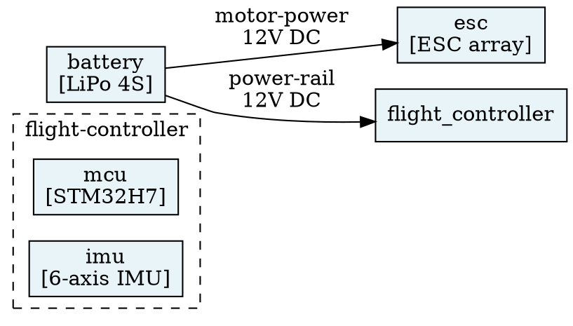

# `rhizz` Specification v0.2

## 1. Project Structure

All `.hcl` files in a project directory are merged into a single model (flat merge, similar to Terraform). No import or namespace mechanism is required for v1.

```
project/
├── project.hcl          # optional project metadata
├── systems.hcl          # system definitions + top-level components
├── subsystem-a.hcl      # deeper component breakdown
├── interfaces.hcl       # interface & message definitions
└── views.hcl            # view definitions
```

File organization is a convention — the tooling treats all `.hcl` files equally.

The merge strategy is described in [SPEC/models.md § Merge](SPEC/models.md#merge).

---

## 2. HCL Schema

> **Impl:** see [SPEC/models.md](SPEC/models.md) — raw deserialization structs, HCL parsing strategy, and resolved model types.

### 2.1 `project` Block (Optional, Singleton)

```hcl
project {
  name    = "drone-v1"
  version = "0.1.0"
  authors = ["Alice", "Bob"]
}
```

| Attribute | Type | Required | Default | Description |
|-----------|------|----------|---------|-------------|
| `name` | string | no | directory name | Human-readable project name |
| `version` | string | no | `"0.0.0"` | Semantic version |
| `authors` | list(string) | no | `[]` | List of authors |

---

### 2.2 `system` Block

Top-level block. One or more per project. Contains components and interfaces.

```hcl
system "consumer-drone" {
  description = "Consumer quadcopter drone, flight-ready configuration"
  tags        = ["product", "drone", "v1"]
  level       = 0

  component "flight-controller" { /* ... */ }
  component "propulsion"        { /* ... */ }

  interface "fc-to-prop" { /* ... */ }
}
```

| Attribute | Type | Required | Default | Description |
|-----------|------|----------|---------|-------------|
| *label* | string | **yes** | — | Unique system identifier |
| `description` | string | no | `""` | Human-readable description |
| `tags` | list(string) | no | `[]` | Filtering tags |
| `level` | integer | no | `0` | Abstraction level |

**Children:** `component`, `interface`

---

### 2.3 `component` Block

Defined inside a `system` or another `component`. Represents a physical or logical building block.

```hcl
component "flight-controller" {
  description = "Central flight management unit"
  tags        = ["electronics", "compute"]
  level       = 1
  leaf        = false

  component "mcu" {
    description = "STM32H7 microcontroller"
    tags        = ["electronics", "compute"]
    level       = 2
    leaf        = true
  }

  component "imu" {
    description = "6-axis inertial measurement unit"
    tags        = ["electronics", "sensor"]
    level       = 2
    leaf        = true
  }

  interface "spi-bus" {
    from      = "mcu"
    to        = "imu"
    direction = "bidirectional"
    tags      = ["electronics", "data"]
    level     = 2
    leaf      = true
  }
}
```

| Attribute | Type | Required | Default | Description |
|-----------|------|----------|---------|-------------|
| *label* | string | **yes** | — | Unique identifier within parent scope |
| `description` | string | no | `""` | Human-readable description |
| `tags` | list(string) | no | `[]` | Filtering tags |
| `level` | integer | no | parent level + 1 | Abstraction level |
| `leaf` | bool | no | `false` | If `true`, component is atomic — no further decomposition |

**Children:** `component` (if not leaf), `interface` (between child components)

---

### 2.4 `interface` Block

Defined inside a `system` or `component`. Connects two **sibling** components within the same parent scope.

```hcl
interface "telemetry-downlink" {
  description = "Telemetry data from drone to ground station"
  tags        = ["rf", "telemetry"]
  level       = 0
  leaf        = false
  direction   = "unidirectional"

  from = "radio-module"
  to   = "ground-station"

  encapsulates = ["mavlink-protocol"]

  message "heartbeat"       { /* ... */ }
  message "position-report" { /* ... */ }
}
```

| Attribute | Type | Required | Default | Description |
|-----------|------|----------|---------|-------------|
| *label* | string | **yes** | — | Unique identifier within parent scope |
| `description` | string | no | `""` | Human-readable description |
| `tags` | list(string) | no | `[]` | Filtering tags |
| `level` | integer | no | parent level + 1 | Abstraction level |
| `leaf` | bool | no | `false` | If `true`, interface is atomic |
| `from` | string | **yes** | — | Source sibling component label |
| `to` | string | **yes** | — | Target sibling component label |
| `direction` | string | no | `"unidirectional"` | `"unidirectional"` or `"bidirectional"` |
| `encapsulates` | list(string) | no | `[]` | Labels of sibling interfaces this one runs on top of |

**Children:** `message` (if not leaf)

---

### 2.5 `message` Block

Defined inside an `interface`. Represents a discrete unit of information exchanged.

```hcl
message "position-report" {
  description = "Periodic GPS position update"
  tags        = ["telemetry", "gps"]
  level       = 1

  field "latitude"  { type = "float64"; unit = "deg"; description = "WGS84 latitude"  }
  field "longitude" { type = "float64"; unit = "deg"; description = "WGS84 longitude" }
  field "altitude"  { type = "float64"; unit = "m";   description = "Altitude MSL"    }
  field "timestamp" { type = "uint64";  unit = "ms";  description = "Unix timestamp"  }
}
```

| Attribute | Type | Required | Default | Description |
|-----------|------|----------|---------|-------------|
| *label* | string | **yes** | — | Unique identifier within parent interface |
| `description` | string | no | `""` | Human-readable description |
| `tags` | list(string) | no | `[]` | Filtering tags |
| `level` | integer | no | parent level | Abstraction level |

**Children:** `field`

---

### 2.6 `field` Block

Defined inside a `message`. Describes a single data element.

```hcl
field "altitude" {
  type        = "float64"
  unit        = "m"
  description = "Altitude above mean sea level"
  required    = true
}
```

| Attribute | Type | Required | Default | Description |
|-----------|------|----------|---------|-------------|
| *label* | string | **yes** | — | Unique field name within parent message |
| `type` | string | **yes** | — | Free-form type string (e.g. `"uint8"`, `"string"`, `"bool"`, `"enum(A,B,C)"`) |
| `description` | string | no | `""` | Human-readable description |
| `unit` | string | no | `""` | Physical unit (e.g. `"m"`, `"Hz"`, `"V"`) |
| `required` | bool | no | `true` | Whether the field is mandatory in the message |

---

### 2.7 `view` Block

Top-level block (not nested inside a system). Defines a filtered perspective rendered as a Graphviz diagram.

```hcl
view "power-distribution" {
  description = "Power delivery paths across the drone"
  tags        = ["power", "review"]
  level       = 0

  system = "consumer-drone"

  filter {
    include_tags   = ["power"]
    exclude_tags   = ["debug"]
    max_level      = 2
    components     = []          # empty = all (whitelist, optional)
    show_messages  = false
  }

  output {
    filename = "power-distribution.dot"
    rankdir  = "LR"             # Graphviz rank direction: TB, LR, BT, RL
  }
}
```

**`filter` sub-block:**

| Attribute | Type | Required | Default | Description |
|-----------|------|----------|---------|-------------|
| `include_tags` | list(string) | no | `[]` (match all) | Only include entities having ≥1 of these tags |
| `exclude_tags` | list(string) | no | `[]` | Exclude entities having any of these tags |
| `max_level` | integer | no | `∞` | Maximum abstraction level to display |
| `components` | list(string) | no | `[]` (all) | Whitelist of component labels to include |
| `show_messages` | bool | no | `true` | Whether to list messages on interface edges |

**`output` sub-block:**

| Attribute | Type | Required | Default | Description |
|-----------|------|----------|---------|-------------|
| `filename` | string | no | `"{view-label}.dot"` | Output file path |
| `rankdir` | string | no | `"TB"` | Graphviz layout direction |

---

## 3. Reference Resolution

> **Impl:** see [Scope lookup helper](SPEC/models.md#scope-lookup-helper) and [Resolution pass](SPEC/models.md#resolution-pass) in models.md.

All references are **name-based within the same parent scope**:

| Context | `from` / `to` resolves to |
|---------|---------------------------|
| Interface inside a `system` | Sibling `component` labels inside that system |
| Interface inside a `component` | Sibling `component` labels inside that component |
| `encapsulates` | Sibling `interface` labels inside the same parent |
| `view.system` | Top-level `system` label |

**No cross-scope or dot-path references in v1.** If a connection spans abstraction levels, model it at the appropriate parent scope.

---

## 4. Validation Rules

> **Impl:** validation operates on the [resolved `Model`](SPEC/models.md#core-resolved-structs).
> Errors/warnings are collected as `Diagnostic` values during the [resolution pass](SPEC/models.md#resolution-pass).

### 4.1 Errors (Halt Compilation)

| Code | Condition |
|------|-----------|
| `E001` | Duplicate label within the same scope and block type |
| `E002` | Interface `from`/`to` references an undefined sibling component |
| `E003` | Interface `encapsulates` references an undefined sibling interface |
| `E004` | Circular encapsulation chain detected |
| `E005` | Leaf component contains child components or interfaces |
| `E006` | Leaf interface contains child messages |
| `E007` | View references an undefined system |
| `E008` | `direction` value is not `"unidirectional"` or `"bidirectional"` |
| `E009` | `field` block is missing required `type` attribute |
| `E010` | More than one `project` block defined across all files |

### 4.2 Warnings (Non-blocking)

| Code | Condition |
|------|-----------|
| `W001` | Non-leaf component has no child components (decomposition pending) |
| `W002` | Non-leaf interface has no messages defined |
| `W003` | Message has no fields defined |
| `W004` | Component is not referenced by any interface (orphan) |
| `W005` | Entity is missing a `description` |
| `W006` | Interface `from` and `to` point to the same component |
| `W007` | `level` value decreases relative to parent (likely a mistake) |

---

## 5. Completion Scoring

> **Impl:** scoring iterates over `Model.components`, `Model.interfaces`, and `Model.messages`,
> see [resolved models](SPEC/models.md#core-resolved-structs). The `leaf`, `children`,
> `messages`, and `fields` fields on those structs provide all inputs needed.

The completion score quantifies how fully the system has been decomposed to
leaf-level entities. Each entity is scored individually, then aggregated.

### Per-Entity Completeness

| Entity | Complete (1.0) | Partial (0.5) | Incomplete (0.0) |
|--------|---------------|---------------|-------------------|
| **Component** (leaf) | Has description | Has no description | — |
| **Component** (non-leaf) | ≥1 child component, all children complete | ≥1 child component, not all children complete | No child components |
| **Interface** (leaf) | Has description | Has no description | — |
| **Interface** (non-leaf) | ≥1 message, all messages complete | ≥1 message, not all messages complete | No messages |
| **Message** | ≥1 field | — | No fields |

### Aggregate Score

$$\text{Score} = \frac{\sum_{i=1}^{N} s_i}{N} \times 100\%$$

Where $s_i$ is the per-entity completeness (0.0, 0.5, or 1.0) and $N$ is the
total number of components, interfaces, and messages. Fields and the system
block itself are excluded from scoring (fields are the leaf-level data — their
existence *is* the completion).

### Output Format

```
Completion Report — consumer-drone
───────────────────────────────────
Components:  8/12 complete  (66.7%)
Interfaces:  3/7  complete  (42.9%)
Messages:    5/10 complete  (50.0%)
───────────────────────────────────
Overall:     16/29           55.2%
```

---

## 6. View Generation (Graphviz)

> **Impl:** the `View`, `ViewFilter`, and `ViewOutput` structs are defined in
> [view models](SPEC/models.md#view-models). The renderer reads from the resolved
> `Model` and applies filter predicates against tags, levels, and component whitelist.
> DOT string generation is provided by the shared `rhizz-dot` crate (see Section 12)
> so that any frontend can produce `.dot` output without re-implementing the logic.

The view renderer applies the filter, then produces a DOT file:

| Model Entity | Graphviz Representation |
|--------------|------------------------|
| Component (leaf) | Box node, solid border |
| Component (non-leaf) | `subgraph cluster_*` containing children |
| Interface | Edge from `from` → `to` (arrow for unidirectional, line for bidirectional) |
| Message | Items in edge label (if `show_messages = true`) |
| Encapsulation | Dashed edge between interfaces, or annotation on label |

Example generated DOT fragment:



---

## 7. CLI Interface

> **Impl:** see [SPEC/cli.md](SPEC/cli.md) — `clap` struct layout, JSON output schema,
> pipeline stages, and error formatting.

The CLI is implemented in the `rhizz-cli` crate, which is a thin frontend
over `rhizz-core`. It is responsible for file discovery, output formatting,
exit codes, and writing generated `.dot` files to disk. All model compilation,
validation, scoring, and view rendering logic lives in `rhizz-core` and
`rhizz-dot` — `rhizz-cli` contains no model logic of its own.

```
rhizz <command> [options] [path]
```

| Command | Description |
|---------|-------------|
| `mbse check <path>` | Parse, validate, and report errors/warnings. Exit code 0 if no errors. |
| `mbse score <path>` | Run `check`, then print the completion report. |
| `mbse views <path>` | Run `check`, then generate all defined views as `.dot` files. |
| `mbse build <path>` | Run all of the above in sequence (default command). |

### Options

| Flag | Description |
|------|-------------|
| `--output-dir`, `-o` | Directory for generated `.dot` files (default: `./out/`) |
| `--strict` | Treat warnings as errors |
| `--json` | Output report in JSON format (for CI/CD integration) |
| `--view <name>` | Only generate a specific view (with `views`/`build`) |
| `--no-color` | Disable colored terminal output |

### Example Session

```bash
$ mbse build ./drone-project/

  Parsing 5 files...
  ✓ Parsed: project.hcl, systems.hcl, fc.hcl, propulsion.hcl, views.hcl

  Validation:
  ✗ E002  interfaces.hcl:14  interface "uart-link" references undefined component "gps-module"
  ⚠ W001  fc.hcl:31          component "power-regulator" has no child components (leaf=false)
  ⚠ W005  propulsion.hcl:8   component "motor" is missing a description

  1 error, 2 warnings — aborting (fix errors to continue)
```

```bash
$ mbse build ./drone-project/   # after fix

  Parsing 5 files... ✓

  Validation:
  ⚠ W001  fc.hcl:31          component "power-regulator" has no child components (leaf=false)
  ⚠ W005  propulsion.hcl:8   component "motor" is missing a description
  0 errors, 2 warnings

  Completion Report — consumer-drone
  ───────────────────────────────────
  Components:  8/12 complete  (66.7%)
  Interfaces:  3/7  complete  (42.9%)
  Messages:    5/10 complete  (50.0%)
  ───────────────────────────────────
  Overall:     16/29           55.2%

  Views:
  ✓ out/power-distribution.dot
  ✓ out/data-flow-overview.dot

  Done.
```

---

## 8. Full Example

A minimal but complete drone project across three files:

### `project.hcl`

```hcl
project {
  name    = "mini-drone"
  version = "0.1.0"
}
```

### `drone.hcl`

```hcl
system "mini-drone" {
  description = "Minimal quadcopter drone"
  tags        = ["product", "drone"]
  level       = 0

  # ── Components ────────────────────────────

  component "flight-controller" {
    description = "Central flight management unit"
    tags        = ["electronics", "compute"]
    leaf        = false

    component "mcu" {
      description = "STM32H7 ARM Cortex-M7"
      tags        = ["electronics", "compute"]
      leaf        = true
    }

    component "imu" {
      description = "ICM-42688 6-axis IMU"
      tags        = ["electronics", "sensor"]
      leaf        = true
    }

    interface "spi-imu" {
      description = "SPI link between MCU and IMU"
      tags        = ["electronics", "data"]
      from        = "mcu"
      to          = "imu"
      direction   = "bidirectional"
      leaf        = true
    }
  }

  component "esc" {
    description = "4-in-1 electronic speed controller"
    tags        = ["electronics", "power", "motor"]
    leaf        = true
  }

  component "battery" {
    description = "4S 1500mAh LiPo"
    tags        = ["power"]
    leaf        = true
  }

  component "radio-rx" {
    description = "ELRS 2.4GHz receiver"
    tags        = ["electronics", "rf", "control"]
    leaf        = true
  }

  # ── Interfaces ────────────────────────────

  interface "dshot-bus" {
    description = "DShot600 motor control signal"
    tags        = ["electronics", "motor", "data"]
    from        = "flight-controller"
    to          = "esc"
    direction   = "unidirectional"
    leaf        = false

    message "throttle-command" {
      description = "Per-motor throttle value"
      tags        = ["motor", "control"]

      field "motor_id" { type = "uint8";  description = "Motor index 1-4" }
      field "value"    { type = "uint16"; description = "Throttle 0-2047"  }
    }
  }

  interface "power-main" {
    description = "Main battery power rail"
    tags        = ["power"]
    from        = "battery"
    to          = "esc"
    direction   = "unidirectional"
    leaf        = true
  }

  interface "power-bec" {
    description = "5V BEC output to flight controller"
    tags        = ["power"]
    from        = "esc"
    to          = "flight-controller"
    direction   = "unidirectional"
    leaf        = true
  }

  interface "crsf-link" {
    description = "Crossfire serial protocol for RC input"
    tags        = ["rf", "control", "data"]
    from        = "radio-rx"
    to          = "flight-controller"
    direction   = "bidirectional"
    leaf        = false

    message "rc-channels" {
      description = "16-channel RC input values"
      tags        = ["control"]

      field "channels" { type = "uint16[16]"; description = "Channel values 172-1811" }
    }

    message "telemetry-frame" {
      description = "Telemetry sent back to transmitter"
      tags        = ["telemetry"]

      field "rssi"    { type = "uint8";   unit = "dBm"; description = "Signal strength" }
      field "battery" { type = "float32"; unit = "V";   description = "Battery voltage"  }
    }
  }
}
```

### `views.hcl`

```hcl
view "full-system" {
  description = "Complete system overview"
  system      = "mini-drone"

  filter {
    max_level = 1
  }

  output {
    filename = "full-system.dot"
    rankdir  = "TB"
  }
}

view "power-only" {
  description = "Power distribution paths"
  system      = "mini-drone"

  filter {
    include_tags  = ["power"]
    show_messages = false
  }

  output {
    filename = "power.dot"
    rankdir  = "LR"
  }
}

view "fc-internals" {
  description = "Flight controller internal architecture"
  system      = "mini-drone"

  filter {
    components = ["flight-controller"]
    max_level  = 3
  }

  output {
    filename = "fc-internals.dot"
    rankdir  = "LR"
  }
}
```

---

## 9. Design Decisions & Future Considerations

| Decision | Rationale |
|----------|-----------|
| Interfaces reference **sibling** components only | Keeps scoping simple; cross-level wiring is modeled at the appropriate parent |
| `type` on fields is a free-form string | Supports gradual specification — no type system to fight during early design |
| `level` auto-increments from parent | Reduces boilerplate; explicit override still available |
| Views are top-level blocks | A view can reference any system; decoupled from the model itself |
| `encapsulates` is a name-based reference | Captures protocol layering (HTTP → TCP → Ethernet) without deep nesting |
| Multiple frontends share one compiler core | Keeps all model semantics in one tested place; frontends own only I/O and presentation |
| DOT rendering in `rhizz-dot` | Pure text transform useful to every frontend; extracted so neither CLI nor GUI re-implements it |

**Out of scope for v1, currently non-goals. Candidates for v2:**

- Cross-system references and shared component libraries
- Constraint / requirement blocks linked to components
- Temporal / sequence diagrams (message ordering)
- Per-message direction in bidirectional interfaces
- Type-checked fields with a schema language
- Diffing / changelog between model versions

---

## 10. Workspace Layout

The repository is organised as a Cargo workspace. The compiler core, the DOT
renderer, and each frontend are separate crates. This enforces a hard boundary:
model logic lives in the core and shared crates; frontends own only I/O and
presentation.

Frontends depend on `rhizz-core` and, when they need to emit DOT output, on
`rhizz-dot`. Frontends do not depend on each other. Any number of frontends may
coexist in the workspace.

> **Impl:** see [SPEC/architecture.md](SPEC/architecture.md) for crate layout and dependency graph.

---

## 11. `rhizz-core`

`rhizz-core` is the model compiler. It is a pure library with no filesystem
access, no terminal dependencies, and no rendering logic. Frontends supply
source text; `rhizz-core` returns a resolved model and a list of diagnostics.

All public types are serialisable and cloneable so that any frontend can store,
transmit, or display results without additional conversion. Diagnostic codes are
part of the public API and must remain stable.

> **Impl:** see [SPEC/architecture.md § rhizz-core](SPEC/architecture.md#rhizz-core)
> for the full API surface and invariants.

---

## 12. `rhizz-dot`

`rhizz-dot` is a shared library that converts a resolved model and a view
definition into a DOT-format string. It encapsulates all view filter logic (tag
filtering, level capping, component whitelist, message visibility) so that no
frontend needs to re-implement it.

> **Impl:** see [SPEC/architecture.md § rhizz-dot](SPEC/architecture.md#rhizz-dot) for the API.

---

## 13. Frontend Contract

A frontend is any crate that consumes `rhizz-core` to present the model to a
user or automated process. Frontends must:

- Own all I/O — file discovery, reading, watching, and writing output.
- Pass source text to `rhizz-core` and receive results; never re-implement parsing, validation, scoring, or view rendering.
- Render diagnostics and results in a manner appropriate to their medium.

The CLI frontend (`rhizz-cli`) and the desktop GUI frontend (`rhizz-gui`, built
with `egui`) are the first two frontends. Additional frontends (web, LSP, etc.)
may be added without changes to the core crates.

> **Impl:** see [SPEC/architecture.md § Frontend Contract](SPEC/architecture.md#frontend-contract)
> and [SPEC/gui.md](SPEC/gui.md) for frontend-specific details.
